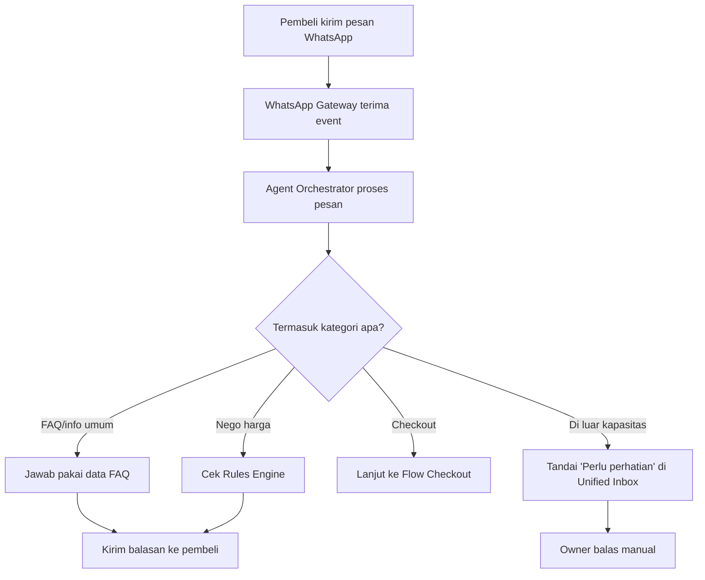
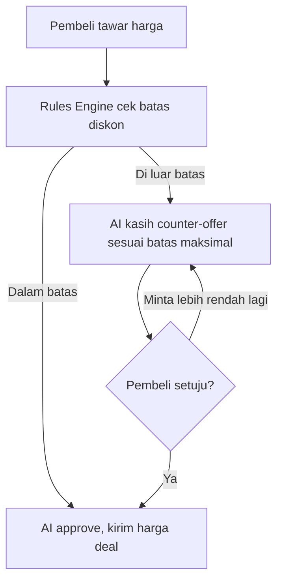
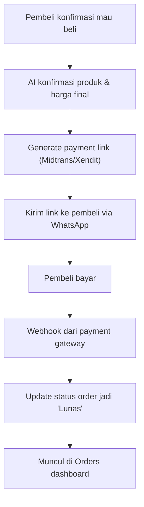
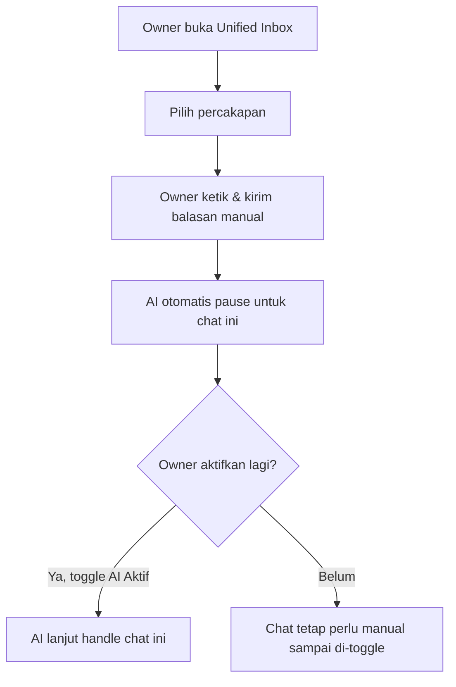

# Flow — TokoPilot (MVP)

## 1. Pesan Masuk & Auto-Reply

```mermaid
flowchart TD
    A[Pembeli kirim pesan WhatsApp] --> B[WhatsApp Gateway terima event]
    B --> C[Agent Orchestrator proses pesan]
    C --> D{Termasuk kategori apa?}
    D -->|FAQ/info umum| E[Jawab pakai data FAQ]
    D -->|Nego harga| F[Cek Rules Engine]
    D -->|Checkout| G[Lanjut ke Flow Checkout]
    D -->|Di luar kapasitas| H["Tandai 'Perlu perhatian' di Unified Inbox"]
    E --> I[Kirim balasan ke pembeli]
    F --> I
    H --> J[Owner balas manual]
```

## 2. Nego Harga

```mermaid
flowchart TD
    A[Pembeli tawar harga] --> B[Rules Engine cek batas diskon]
    B -->|Dalam batas| C[AI approve, kirim harga deal]
    B -->|Di luar batas| D[AI kasih counter-offer sesuai batas maksimal]
    D --> E{Pembeli setuju?}
    E -->|Ya| C
    E -->|Minta lebih rendah lagi| D
```

## 3. Checkout

```mermaid
flowchart TD
    A[Pembeli konfirmasi mau beli] --> B[AI konfirmasi produk & harga final]
    B --> C["Generate payment link (Midtrans/Xendit)"]
    C --> D[Kirim link ke pembeli via WhatsApp]
    D --> E[Pembeli bayar]
    E --> F[Webhook dari payment gateway]
    F --> G["Update status order jadi 'Lunas'"]
    G --> H[Muncul di Orders dashboard]
```

## 4. Owner Ambil Alih Manual

```mermaid
flowchart TD
    A[Owner buka Unified Inbox] --> B[Pilih percakapan]
    B --> C[Owner ketik & kirim balasan manual]
    C --> D["AI otomatis pause untuk chat ini"]
    D --> E{Owner aktifkan lagi?}
    E -->|Ya, toggle AI Aktif| F[AI lanjut handle chat ini]
    E -->|Belum| G[Chat tetap perlu manual sampai di-toggle]
```
